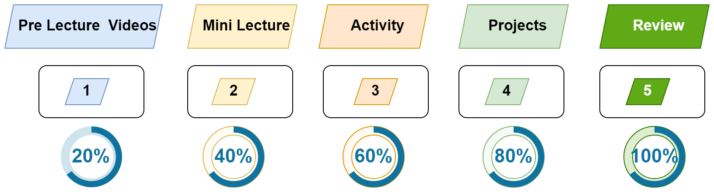

# This Week in Brief

> [!IMPORTANT]  
> - [Homework Before Next Session](./material/Homework.md).
> - About Privacy
> - [Zoom Recordings](https://metropoliafi-my.sharepoint.com/:f:/g/personal/samiben_metropolia_fi/IgBa_dyuxYAISaLK3j9jXNBNAbMwTiSJEvT0Mv1aXgWBvuo?e=JM8kA8)
> - [9 Proven Time Management Techniques and Tools](https://www.usa.edu/blog/time-management-techniques/)

---

> [!NOTE]  
> - Tentative Timeline per session
>   - Mini lecture (~35min)
>   - Group / Pair programming `+ Break` (~50min)
>   - Mini lecture (~35min)
>   - Group / Pair programming (~35min)

----

## How You'll Learn in This Course

We'll follow a 5-step learning cycle as shown in the figure below:

1. **Watch Pre-Lecture Videos**: Get a 20% grasp of the topic.
2. **Mini Lecture**: Increase your understanding to 40%.
3. **Pair Programming**: Collaborate to reach 60% comprehension.
4. **Mini Project**: Deepen your understanding to 80%.
5. **Extra Digging**: Achieve full mastery, bringing your understanding to 100%.

----

## Topics

- Why?
- How?
- What? 
- WHere? When?

----

> [!NOTE]  
> Please put a message in the Zoom chat if you would like to discuss either of the topics below:
> * **Group Placement (Especially for International Students):** Since many students already know each other, we can discuss whether you would prefer to form a new group or join an existing one. 
> * **Alternative Grading Options:** If you are interested in discussing alternative grading pathways to pass the course.

----

## Morning: Why This 3-Course Package Matters

- [From Data to AI Agents](./material/part1-state-ai-txt.md)
- [The AI Package](./material/img/ai-package.png)
- About the Course
  - [Schedule](./material/schedule.md)
  - [Course Description](./material/part1-about-course.md)
  - [High-Level Overview (Diagram)](./material/img/dh-course.png)
- [Activity 1: Getting Started](./material/activity1.md)

----

## Afternoon:

- [Activity 2](./material/activity2.md)
- [Group Activity: Brainstorming & Planning Your Mini-Project](./material/Brainstorming.md)
- Development tooling
- [Group Homework](./material/Homework-gr.md)

----

## Recap

- If you are unable to access the Zoom recording, please send me an email.
- **Homework:**
  - [Individual Homework Before Next Session](./material/Homework.md)
  - [Group Homework](./material/Homework-gr.md)
- **Potential Exam Questions**: You will also receive potential exam questions throughout the course. These will help you identify key concepts and guide your independent study as we progress toward the exam in Week 8.

<!-- 

> [!NOTE]  
> Highlights information that users should take into account, even when skimming.

> [!TIP]
> Optional information to help a user be more successful.

> [!IMPORTANT]  
> Crucial information necessary for users to succeed.

> [!WARNING]  
> Critical content demanding immediate user attention due to potential risks.

> [!CAUTION]
> Negative potential consequences of an action. 

-->