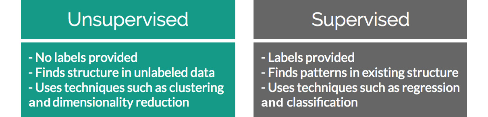
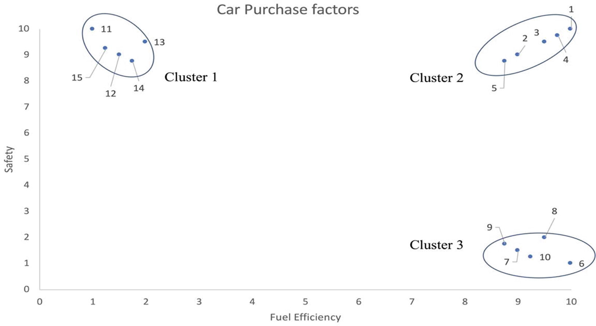
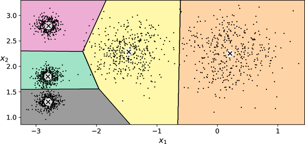
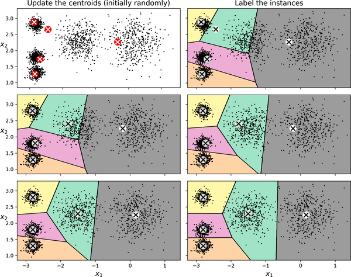
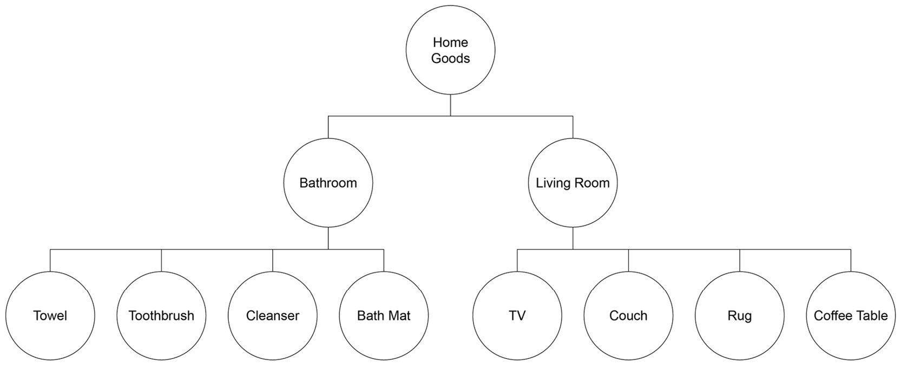

# Activity 1: Introduction to Unsupervised Learning with Clustering

How can we discover groups when nobody has supplied the correct group labels? Investigate that question using customer data, K-Means, and agglomerative hierarchical clustering.

Read each explanation, predict what will happen, and then run the code in Google Colab. Try the questions before opening their hints or solutions. Sections 1–6 follow the same sequence as the [Part 1 theory](part1.md).

## Table of contents

- [1. From prediction to discovering structure](#1-from-prediction-to-discovering-structure)
  - [1.1 Connect to classification and regression](#11-connect-to-classification-and-regression)
  - [1.2 Understand the clustering question](#12-understand-the-clustering-question)
- [2. Representing customers and measuring similarity](#2-representing-customers-and-measuring-similarity)
  - [2.1 Load and inspect the data](#21-load-and-inspect-the-data)
  - [2.2 Select features and visualize](#22-select-features-and-visualize)
  - [2.3 Calculate Euclidean distance](#23-calculate-euclidean-distance)
  - [2.4 Consider units and scale](#24-consider-units-and-scale)
- [3. Understanding and applying K-Means](#3-understanding-and-applying-k-means)
  - [3.1 Understand K and centroids](#31-understand-k-and-centroids)
  - [3.2 Follow the assignment and update cycle](#32-follow-the-assignment-and-update-cycle)
  - [3.3 Fit and inspect a model](#33-fit-and-inspect-a-model)
  - [3.4 Visualize the result](#34-visualize-the-result)
  - [3.5 Experiment with K](#35-experiment-with-k)
- [4. Building a hierarchy of clusters](#4-building-a-hierarchy-of-clusters)
  - [4.1 Understand agglomerative merging](#41-understand-agglomerative-merging)
  - [4.2 Fit and compare the models](#42-fit-and-compare-the-models)
  - [4.3 Read a simple dendrogram](#43-read-a-simple-dendrogram)
- [5. Interpreting results and recognizing limitations](#5-interpreting-results-and-recognizing-limitations)
  - [5.1 Describe customer profiles](#51-describe-customer-profiles)
  - [5.2 Investigate overlapping groups](#52-investigate-overlapping-groups)
  - [5.3 Cluster data without obvious groups](#53-cluster-data-without-obvious-groups)
  - [5.4 Recognize the limitations](#54-recognize-the-limitations)
- [6. Consolidation and preparation for Part 2](#6-consolidation-and-preparation-for-part-2)
  - [6.1 Compare the two methods](#61-compare-the-two-methods)
  - [6.2 Check your understanding](#62-check-your-understanding)
  - [6.3 Prepare for evaluation](#63-prepare-for-evaluation)

## Learning objectives

By the end of this activity, you should be able to:

- distinguish clustering from classification and regression;
- explain how features, distance, and scale define similarity;
- calculate a simple Euclidean distance and centroid;
- explain and apply the K-Means assignment and update cycle;
- interpret cluster labels, plots, and customer profiles;
- explain agglomerative clustering and read a simple dendrogram;
- recognize why a clustering result needs evaluation.

---

## 1. From prediction to discovering structure

Before writing or running any clustering algorithms, it is helpful to contrast the clustering paradigm with the supervised learning tasks encountered in earlier modules.

### 1.1 Connect to classification and regression



In the previous lectures, a model learned from features and a known target. Classification predicted a category, such as a flower species. Regression predicted a numerical value, such as a car's MPG.

Unsupervised learning changes the question. The learning process receives features without a target guiding it and looks for structure in those features.

| Approach | Example question | Target used during training? |
|---|---|---|
| Classification | Which known species does this flower belong to? | Yes: species |
| Regression | What MPG should we predict for this car? | Yes: MPG |
| Clustering | Which customers have similar characteristics? | No supplied customer-group target |

### 1.2 Understand the clustering question



Clustering groups observations according to similarity. Each observation in our main example is a customer. We will investigate groups using annual income and spending score.

The algorithm does not receive names such as “high-spending customers.” It produces group assignments; we interpret those groups afterward.

**Question 1 — Is a label being used to learn?**

The Iris dataset contains flower measurements and known species. You give K-Means only the measurements and keep species for a later comparison. Is the clustering supervised or unsupervised? Explain why.

<details>
<summary>Optional LLM hint</summary>

Ask: “Help me distinguish labels that exist in a dataset from labels used to guide training. Ask me what K-Means actually receives before giving an answer.”

</details>

<details>
<summary>Solution</summary>

The clustering is unsupervised because species labels do not guide fitting. Labels can exist elsewhere in a dataset without being used to train the clustering model. Comparing the groups with species afterward is a separate analysis.

</details>

---

## 2. Representing customers and measuring similarity

To group observations algorithmically, we need a concrete numerical representation of each observation and a formal way to measure similarity between them. In this section, we load customer records, select numerical attributes, and examine how geometric distance represents similarity.

### 2.1 Load and inspect the data

The main example uses the **Mall Customers** dataset:

| Column | Meaning | Role in this experiment |
|---|---|---|
| `CustomerID` | Customer identifier | Excluded from distances |
| `Gender` | Categorical demographic variable | Excluded from this numerical example |
| `Age` | Age in years | Available for later exploration |
| `Annual Income (k$)` | Income in thousands of dollars | Clustering feature |
| `Spending Score (1-100)` | Spending score supplied by the dataset provider | Clustering feature |

The spending score is an input here, not a target to predict. The dataset does not supply a correct customer-segment label.

Run this setup cell in Colab:

```python
!pip install -q scikit-learn pandas matplotlib scipy
```

*Code explanation:* This command ensures that the required packages are present in your runtime environment. The `-q` (quiet) flag suppresses verbose installation logs.

Import the libraries. NumPy handles numerical arrays, pandas handles tables, Matplotlib draws plots, and the other imports provide clustering tools.

```python
import numpy as np
import pandas as pd
import matplotlib.pyplot as plt

from sklearn.cluster import KMeans, AgglomerativeClustering
from sklearn.datasets import make_blobs
from scipy.cluster.hierarchy import linkage, dendrogram
```

*Code explanation:* We import `pandas` for tabular manipulation, `numpy` for matrix operations, and `matplotlib.pyplot` for visualization. From `sklearn`, we import both partition-based (`KMeans`) and hierarchical (`AgglomerativeClustering`) models, as well as `make_blobs` to generate synthetic benchmark data. From `scipy`, we import routines to compute linkage matrices and render dendrogram trees.

Load and inspect the data:

```python
url = (
    "https://raw.githubusercontent.com/AI-Learning-Repo/"
    "Data-Handling/refs/heads/week5/datasets/mall-customers.csv"
)
customers = pd.read_csv(url)

display(customers.head())
print("Rows and columns:", customers.shape)
customers.info()
print("Missing values per column:")
print(customers.isna().sum())
```

*Code explanation:* The script downloads the dataset directly into a pandas DataFrame using `pd.read_csv()`. `display(customers.head())` previews the first 5 records. `customers.shape` prints the total dimensions `(rows, columns)`. `customers.info()` confirms memory usage and column data types, while `customers.isna().sum()` tallies missing entries per column to verify complete records.

Check the actual output. The supplied dataset is expected to contain 200 customers and five columns. Inspection tells us whether that expectation holds and whether cleaning is needed.

### 2.2 Select features and visualize

Having confirmed that the dataset loaded correctly, we now isolate the specific dimensions of interest. Selecting features defines the geometric space in which similarity is computed.

Select the two numerical features. For this introductory experiment, remove rows missing either value and check how many were removed. Keep the DataFrame index so labels can later be attached to the correct rows.

```python
feature_names = ["Annual Income (k$)", "Spending Score (1-100)"]
X_df = customers[feature_names].dropna().copy()
X = X_df.to_numpy()

print("Rows removed:", len(customers) - len(X_df))
print("Clustering data shape:", X.shape)
```

*Code explanation:* We isolate `Annual Income (k$)` and `Spending Score (1-100)` into a sub-DataFrame `X_df`. Calling `.dropna().copy()` removes incomplete rows while preserving an independent index. `.to_numpy()` extracts the raw underlying 2D NumPy array `X`, which is the format scikit-learn algorithms accept.

Each row represents one customer; each column represents one feature. A shape of `(200, 2)` means 200 observations described by two features.

Differences between customer identifiers are not meaningful measurements of similarity. Leaving `Gender` out keeps this example numerical and easy to visualize; it does not establish that categorical information is never useful.

```python
plt.figure(figsize=(8, 6))
plt.scatter(X[:, 0], X[:, 1], alpha=0.8)
plt.xlabel("Annual Income (k$)")
plt.ylabel("Spending Score (1-100)")
plt.title("Mall Customers: before clustering")
plt.show()
```

*Code explanation:* We create an 8x6-inch figure using `plt.figure()`. `plt.scatter()` maps the first column (`X[:, 0]`, Income) to the horizontal axis and the second column (`X[:, 1]`, Spending Score) to the vertical axis. The parameter `alpha=0.8` adds slight transparency so overlapping points remain visible.

**Question 2 — Read the feature space**

1. Which regions appear relatively crowded or separated?
2. Are there customers between apparent groups?
3. Why might these two features be useful for segmentation?
4. Does the plot prove one correct number of clusters?

<details>
<summary>Optional LLM hint</summary>

Ask: “Help me describe a customer scatter plot using income and spending score. Separate what I can observe from what I would need more evidence to conclude.”

</details>

<details>
<summary>Possible answer</summary>

Describe the regions visible in your plot using the axis names. Income and spending score distinguish customers with different combinations of income and spending behavior. Some observations may lie between apparent groups.

The plot suggests possible groupings, but does not establish a unique correct number. Features, scale, algorithm, and the purpose of the analysis also matter.

</details>

### 2.3 Calculate Euclidean distance

To move from visual impressions of grouping to algorithmic execution, we must compute pairwise proximity numerically.

Euclidean distance measures the straight-line distance between two points. For two features:

$$
d(A,B)=\sqrt{(x_B-x_A)^2+(y_B-y_A)^2}
$$

For $A=(1,2)$ and $B=(4,6)$:

$$
d(A,B)=\sqrt{(4-1)^2+(6-2)^2}=\sqrt{9+16}=5
$$

Smaller distance means greater similarity **under the selected features and units**. It does not mean two customers are similar in every respect.

**Question 3 — Calculate a distance**

Calculate the Euclidean distance between $A=(2,3)$ and $B=(5,7)$. Show the coordinate differences before calculating the final distance.

<details>
<summary>Optional LLM hint</summary>

Ask: “Guide me through the Euclidean distance between (2,3) and (5,7). Let me calculate the differences, their squares, and the square root myself.”

</details>

<details>
<summary>Solution</summary>

The coordinate differences are 3 and 4:

```math
d(A,B)=\sqrt{(5-2)^2+(7-3)^2}=\sqrt{3^2+4^2}=\sqrt{25}=5
```

</details>

### 2.4 Consider units and scale

Because distance depends directly on coordinate differences, the numerical range of each feature affects how similarity is calculated.

Suppose two customers differ by 5 years in age and 1,000 dollars in income. In a raw Euclidean distance calculation, the squared income difference is much larger than the squared age difference. That reflects numerical units, not necessarily the importance of income.

Standardization is one way to put features on comparable scales. We will investigate it practically in Activity 2.

For this first experiment, we deliberately use income in thousands of dollars and spending score in their original units. This makes plots and centroids easy to read. It is a modeling choice, not a claim that these units give the best weighting.

**Checkpoint:** If we converted income from thousands of dollars to dollars, could the clustering change even though the customers had not changed?

<details>
<summary>Answer</summary>

Yes. Income differences would become 1,000 times larger, changing their contribution to distance relative to spending-score differences. The geometry seen by the algorithm would change.

</details>

---

## 3. Understanding and applying K-Means

Now that we have defined points in feature space and distance between them, we can study how an algorithm groups those points. K-Means is a standard partitioning algorithm based on cluster centroids.

### 3.1 Understand K and centroids



K-Means partitions observations into a chosen number of groups, **K**, around centers called **centroids**. A centroid is the mean position of its assigned observations. It has one coordinate per feature and need not coincide with an actual observation.

For `(1,2)`, `(2,3)`, and `(3,4)`, take the mean of each coordinate:

$$
\mu=\left(\frac{1+2+3}{3},\frac{2+3+4}{3}\right)=(2,3)
$$

**Question 4 — Calculate a centroid**

A cluster contains `(2,4)`, `(4,6)`, and `(6,8)`. Calculate its centroid. Why do we calculate the two means separately?

<details>
<summary>Optional LLM hint</summary>

Ask: “Help me calculate a centroid. Ask me to average each feature separately and explain what each coordinate represents.”

</details>

<details>
<summary>Solution</summary>

```math
\mu=\left(\frac{2+4+6}{3},\frac{4+6+8}{3}\right)=(4,6)
```

Each feature is a separate dimension, so the centroid needs a mean for each dimension.

</details>

### 3.2 Follow the assignment and update cycle

Centroids do not start in their final positions. The algorithm proceeds through an iterative cycle to find them.



1. Choose K.
2. Initialize K centroids.
3. Assign every observation to its nearest centroid.
4. Recalculate each centroid as the mean of its assigned observations.
5. Repeat assignment and updating until a stopping condition is reached.

The algorithm tries to reduce the total squared distances from observations to their assigned centroids. Different initial centers can lead to different results; a single run is not guaranteed to find the best possible partition.

**Question 5 — Assign an observation**

An observation has distances `3.2`, `1.5`, and `4.0` to the centroids of clusters `0`, `1`, and `2`. Which cluster receives it? What happens to the centroids after all observations have been assigned?

<details>
<summary>Solution</summary>

Cluster `1` receives it because `1.5` is the smallest distance. After assignment, each centroid is recalculated from its current observations. Subsequent assignments may change as the centers move.

</details>

### 3.3 Fit and inspect a model

We will now execute this assignment-and-update procedure using scikit-learn's `KMeans` implementation on the mall customer dataset.

Use three clusters as an initial experiment. We have not established that three is the best number for these customers.

```python
kmeans = KMeans(n_clusters=3, random_state=42, n_init=10)
kmeans.fit(X)

labels = kmeans.labels_
print("First 20 cluster labels:", labels[:20])
print("Centroid array shape:", kmeans.cluster_centers_.shape)
```

*Code explanation:* We instantiate `KMeans` with $K=3$. `random_state=42` guarantees consistent pseudo-random initialization. `n_init=10` directs scikit-learn to run 10 independent initializations and select the run that minimizes within-cluster inertia. Calling `.fit(X)` executes the iterative assignment and update loop. Once fitted, `kmeans.labels_` stores the final integer cluster IDs assigned to each point, and `kmeans.cluster_centers_` contains the coordinates of the 3 centroids.

| Setting | Meaning |
|---|---|
| `n_clusters=3` | Request three clusters |
| `random_state=42` | Make random initialization reproducible in the same setup |
| `n_init=10` | Try ten initializations and retain the result with the lowest within-cluster sum of squared distances |

Notice `fit(X)`: no target `y` is supplied. The model learns centers and assignments from features. See the [K-Means documentation](https://scikit-learn.org/stable/modules/generated/sklearn.cluster.KMeans.html) for the API details.

Labels are **arbitrary identifiers**. Cluster `0` is not better than cluster `1`, and neither number automatically names a customer category.

**Question 6 — Interpret the outputs**

1. Why does `cluster_centers_.shape` equal `(3, 2)`?
2. If another run calls the same groups `2`, `0`, and `1`, has their membership necessarily changed?

<details>
<summary>Solution</summary>

There are three centroids, each with two feature coordinates. Renaming groups does not change which observations belong together. Compare membership and feature patterns rather than numerical label names alone.

</details>

### 3.4 Visualize the result

To understand how the mathematical output partitions the feature space, we overlay the cluster assignments and centroid locations onto a scatter plot.

Plot customers using their labels, then add the centroids:

```python
plt.figure(figsize=(8, 6))
plt.scatter(X[:, 0], X[:, 1], c=labels, cmap="tab10", alpha=0.8)
plt.scatter(
    kmeans.cluster_centers_[:, 0], kmeans.cluster_centers_[:, 1],
    marker="X", s=220, c="black", label="Centroids"
)
plt.xlabel("Annual Income (k$)")
plt.ylabel("Spending Score (1-100)")
plt.title("K-Means customer groups: K = 3")
plt.legend()
plt.show()

centroids = pd.DataFrame(kmeans.cluster_centers_, columns=feature_names)
centroids.index.name = "Cluster"
display(centroids.round(2))
```

*Code explanation:* Points are colored using `c=labels`, with `cmap="tab10"` providing distinct categorical hues. The second call to `plt.scatter()` places prominent black crosses (`marker="X"`, size `s=220`) at the centroid coordinates stored in `kmeans.cluster_centers_`. Finally, we convert the centroid coordinates into a labeled pandas DataFrame and display their values rounded to 2 decimal places.

Match the centers in the plot to the table. Because the model used original units, their coordinates represent income in thousands of dollars and spending score.

Describe where the groups lie. Do not infer motives or customer value from a label or plot alone.

### 3.5 Experiment with K

The choice of $K=3$ was arbitrary. We can examine how the partition changes when we change $K$.

**Predict first:** What might change if we request two groups instead of three?

```python
kmeans_2 = KMeans(n_clusters=2, random_state=42, n_init=10)
labels_2 = kmeans_2.fit_predict(X)

fig, axes = plt.subplots(1, 2, figsize=(13, 5), sharex=True, sharey=True)
for ax, model, group_labels, k in [
    (axes[0], kmeans_2, labels_2, 2),
    (axes[1], kmeans, labels, 3)
]:
    ax.scatter(X[:, 0], X[:, 1], c=group_labels, cmap="tab10", alpha=0.8)
    ax.scatter(
        model.cluster_centers_[:, 0], model.cluster_centers_[:, 1],
        marker="X", s=180, c="black"
    )
    ax.set_xlabel("Annual Income (k$)")
    ax.set_title(f"K-Means: K = {k}")
axes[0].set_ylabel("Spending Score (1-100)")
plt.tight_layout()
plt.show()
```

*Code explanation:* We configure a new model `kmeans_2` with `n_clusters=2` and obtain labels using `fit_predict(X)`. Using `plt.subplots(1, 2)`, we create two side-by-side subplots sharing identical axis limits (`sharex=True`, `sharey=True`). A concise loop iterates over the models and axes, plotting data points and centroids side by side to facilitate visual comparison.

`fit_predict(X)` fits the model and returns its labels in one step.

**Question 7 — Interpret the experiment**

What changed in the grouping? Is K = 2 necessarily a simple merge of the K = 3 groups? Can either plot establish the correct K by itself?

<details>
<summary>Optional LLM hint</summary>

Ask: “Help me compare K-Means plots for K = 2 and K = 3. Focus on which observations belong together, not whether the colors match.”

</details>

<details>
<summary>Possible answer</summary>

The number of groups and centroid positions change. Boundaries and memberships may also change. K-Means fits a new partition for each K, so its solutions need not form a nested sequence of merges.

Neither plot establishes one objectively correct K. The choice requires evaluation and interpretation, developed in Activity 2.

</details>

---

## 4. Building a hierarchy of clusters

K-Means creates a flat partition for a fixed value of $K$. Hierarchical clustering takes a different approach: it constructs a tree of nested groupings across multiple scales.

### 4.1 Understand agglomerative merging



Agglomerative hierarchical clustering starts with every observation in its own cluster. It repeatedly merges two clusters according to a **linkage criterion**, producing a hierarchy of larger groups.

For four observations, one possible sequence is:

```text
{A} {B} {C} {D}
        ↓
{A,B}   {C} {D}
        ↓
{A,B}   {C,D}
        ↓
    {A,B,C,D}
```

This procedure builds nested groups. Once two groups merge in agglomerative clustering, that merge is not undone later.

### 4.2 Fit and compare the models

To see how this bottom-up approach compares with K-Means on the same data, we fit an agglomerative model requesting 3 clusters.

Use the same customer features and units as K-Means:

```python
hierarchical = AgglomerativeClustering(n_clusters=3, linkage="ward")
hierarchical_labels = hierarchical.fit_predict(X)

fig, axes = plt.subplots(1, 2, figsize=(13, 5), sharex=True, sharey=True)
for ax, group_labels, title in [
    (axes[0], labels, "K-Means: three clusters"),
    (axes[1], hierarchical_labels, "Agglomerative: three clusters")
]:
    ax.scatter(X[:, 0], X[:, 1], c=group_labels, cmap="tab10", alpha=0.8)
    ax.set_xlabel("Annual Income (k$)")
    ax.set_title(title)
axes[0].set_ylabel("Spending Score (1-100)")
plt.tight_layout()
plt.show()
```

*Code explanation:* We instantiate `AgglomerativeClustering` configured with `linkage="ward"`, which merges clusters to minimize total within-cluster variance. Calling `.fit_predict(X)` executes the merges until three clusters remain, returning the cluster labels. We then plot the K-Means partition alongside the agglomerative partition for comparison. Note that Agglomerative clustering does not compute point centroids as parameters, so only point assignments are shown.

Ward linkage chooses merges that produce the smallest increase in within-cluster sum of squares. `n_clusters=3` requests three final groups. Other linkage choices are explored in Activity 2. See the [agglomerative clustering documentation](https://scikit-learn.org/stable/modules/generated/sklearn.cluster.AgglomerativeClustering.html).

**Question 8 — Compare the procedures**

Both models return three groups. Must memberships be identical? Explain their different procedures, then describe one similarity or difference in your plots. Matching colors need not represent matching groups.

<details>
<summary>Solution</summary>

Memberships need not be identical. K-Means repeatedly assigns observations to centroids and updates those centers. Agglomerative clustering progressively merges groups using linkage.

Different procedures can produce different partitions of the same data. A difference alone does not prove either result wrong.

</details>

### 4.3 Read a simple dendrogram

The complete history of agglomerative merges can be visualized as a tree diagram, known as a dendrogram.

A **dendrogram** displays a hierarchy: leaves are observations, branches join groups, and merge heights show the linkage value at each merge.

Start with four deliberately simple points so every branch is readable. These are a separate demonstration, not a customer subset.

```python
X_small = np.array([[1, 1], [1, 2], [8, 8], [8, 9]])
small_names = ["A", "B", "C", "D"]
Z_small = linkage(X_small, method="ward")

plt.figure(figsize=(7, 5))
dendrogram(Z_small, labels=small_names)
plt.axhline(y=5, color="red", linestyle="--", label="Example cut")
plt.xlabel("Observation")
plt.ylabel("Ward linkage height")
plt.title("A hierarchy of four observations")
plt.legend()
plt.show()
```

*Code explanation:* `linkage(X_small, method="ward")` from `scipy.cluster.hierarchy` performs hierarchical agglomerative clustering and returns a linkage matrix `Z_small`, which records the order, merged cluster indices, and distance heights for each step. `dendrogram()` plots this matrix as a tree with observation names on the leaf axis. `plt.axhline(y=5)` adds a horizontal threshold line to illustrate where cutting the tree yields separate clusters.

**Question 9 — Read the hierarchy**

1. Which pairs merge before the final merge?
2. What does the higher final merge suggest?
3. How many groups remain if we cut at the dashed line?

<details>
<summary>Optional LLM hint</summary>

Ask: “Help me read a dendrogram. Ask me to identify leaves, low merges, and branches crossed by a horizontal cut before explaining the result.”

</details>

<details>
<summary>Solution</summary>

A joins B, and C joins D. These two merge heights are equal, so their display order is unimportant. The higher final merge indicates a larger linkage value for combining the pairs.

The dashed line leaves two groups: `{A,B}` and `{C,D}`. The height is determined by Ward linkage, rather than simply being the distance between any two individual observations.

</details>

Now inspect the full customer hierarchy:

```python
Z_customers = linkage(X, method="ward")

plt.figure(figsize=(12, 5))
dendrogram(Z_customers, no_labels=True)
plt.xlabel("Customers (individual labels hidden)")
plt.ylabel("Ward linkage height")
plt.title("Mall Customers: hierarchical clustering")
plt.show()
```

*Code explanation:* Here we compute Ward linkage for all 200 customer records in `X`. In `dendrogram()`, setting `no_labels=True` hides the 200 leaf indices along the horizontal axis, keeping the tree legible while highlighting the major branch merges.

The larger tree is harder to read observation by observation. Focus on major merges. A hierarchy offers several levels of grouping; it does not automatically identify the most useful level.

---

## 5. Interpreting results and recognizing limitations

Clustering models produce cluster labels mechanically. The remaining task is to examine what those groupings represent and identify where the algorithms may struggle.

### 5.1 Describe customer profiles

To move beyond numeric cluster labels, we calculate summary statistics for each cluster in terms of the original features.

Return to the original K = 3 customer model. Attach its labels to the matching rows and summarize each group:

```python
clustered_customers = X_df.copy()
clustered_customers["Cluster"] = labels

profile = clustered_customers.groupby("Cluster")[feature_names].mean()
profile.insert(0, "Customers", clustered_customers.groupby("Cluster").size())
display(profile.round(2))
```

*Code explanation:* We copy the feature DataFrame `X_df` and append the model's assigned `labels` as a new column called `"Cluster"`. We group by this column and compute the mean of each feature using `.groupby("Cluster")[feature_names].mean()`. `profile.insert(0, "Customers", ...)` adds cluster counts as the first column, producing a summary table of cluster sizes and centers.

A description such as “relatively high income and low spending score” should follow from these values, not from the cluster number.

**Question 10 — Interpret without inventing**

Describe each group in one sentence using the table. Why do these summaries not establish customers' motives or permanent categories? What might change if age were another clustering feature?

<details>
<summary>Optional LLM hint</summary>

Ask: “Help me describe clusters from their sizes and mean income and spending score. Use only the table's evidence, and ask me what I cannot conclude.”

</details>

<details>
<summary>Possible answer</summary>

Use relative descriptions supported by your output. A mean summarizes a group; individual customers can differ substantially from that mean.

These features do not establish motives, and grouping depends on modeling choices. Adding age changes the feature space and could change distances and memberships. Its scale would also need consideration.

</details>

### 5.2 Investigate overlapping groups

In real-world data, clusters are rarely cleanly separated. We can use synthetic datasets to study how K-Means behaves when cluster spread and overlap increase.

We now switch explicitly to **synthetic data** for a controlled experiment. Change cluster spread while keeping generation centers and observation count fixed. This does not claim that the customer data were generated this way.

**Predict first:** Will groups be easier to identify when points are tightly concentrated or widely spread?

```python
generation_centers = [[-3, 0], [0, 3], [3, 0]]
fig, axes = plt.subplots(1, 2, figsize=(12, 5), sharex=True, sharey=True)

for ax, spread in zip(axes, [0.5, 2.5]):
    X_demo, generation_labels = make_blobs(
        n_samples=300, centers=generation_centers,
        cluster_std=spread, random_state=42
    )
    demo_model = KMeans(n_clusters=3, random_state=42, n_init=10)
    demo_labels = demo_model.fit_predict(X_demo)
    ax.scatter(X_demo[:, 0], X_demo[:, 1], c=demo_labels, cmap="tab10", alpha=0.7)
    ax.scatter(
        demo_model.cluster_centers_[:, 0], demo_model.cluster_centers_[:, 1],
        marker="X", s=160, c="black"
    )
    ax.set_title(f"Synthetic data: spread = {spread}")
    ax.set_xlabel("Feature 1")
    ax.set_aspect("equal", adjustable="box")
axes[0].set_ylabel("Feature 2")
plt.tight_layout()
plt.show()
```

*Code explanation:* We test two standard deviations (`spread = 0.5` and `spread = 2.5`) with `make_blobs()`, keeping the same cluster centers. In each case, a K-Means model partitions the data. Setting `ax.set_aspect("equal", adjustable="box")` prevents visual distortion by ensuring equal scaling on both axes.

Colors show **K-Means assignments**, not generation labels. The generator supplies `generation_labels`, but we never give them to K-Means.

**Question 11 — Explain ambiguity**

Which experiment has more overlap? Does K-Means still assign every observation? Does receiving a label mean an observation has an unambiguous natural group?

<details>
<summary>Solution</summary>

The larger spread produces more dispersed, overlapping groups. K-Means still assigns every observation, including points between apparent groups. An assignment is a model output, not a guarantee of an obvious natural category.

</details>

### 5.3 Cluster data without obvious groups

A key property of K-Means is that it will partition data even when no meaningful groups exist. We can demonstrate this by running the algorithm on uniformly distributed points.

What happens when observations are sampled uniformly across a square, without deliberately creating groups?

```python
rng = np.random.default_rng(42)
X_random = rng.uniform(0, 10, size=(300, 2))
random_model = KMeans(n_clusters=3, random_state=42, n_init=10)
random_labels = random_model.fit_predict(X_random)

fig, axes = plt.subplots(1, 2, figsize=(12, 5), sharex=True, sharey=True)
axes[0].scatter(X_random[:, 0], X_random[:, 1], alpha=0.7)
axes[0].set_title("Uniformly sampled data")
axes[1].scatter(
    X_random[:, 0], X_random[:, 1], c=random_labels, cmap="tab10", alpha=0.7
)
axes[1].set_title("The same data partitioned by K-Means")
for ax in axes:
    ax.set_xlabel("Feature 1")
    ax.set_aspect("equal", adjustable="box")
axes[0].set_ylabel("Feature 2")
plt.tight_layout()
plt.show()
```

*Code explanation:* Using `np.random.default_rng(42)`, we generate 300 points distributed uniformly across a 2D interval `[0, 10)`. The left plot shows the raw unclustered points. The right plot shows the same points colored by K-Means cluster assignments, illustrating how the algorithm divides continuous, unstructured space into discrete regions.

**Question 12 — Distinguish a partition from evidence**

Does the colored plot prove the data contain three natural groups? Explain what the algorithm was asked to do.

<details>
<summary>Solution</summary>

No. K-Means was asked to partition these observations into three groups and does so even without clearly separated natural groups. Colors make the partition visible; they do not independently validate it.

</details>

### 5.4 Recognize the limitations

The experiments above highlight several practical limitations to keep in mind when working with clustering algorithms:

| Issue | Why it matters |
|---|---|
| Chosen K | A K-Means result does not validate the requested number of groups |
| Features and scale | Different representations change the distances used by both methods |
| Shape and overlap | K-Means partitions around centers; elongated or overlapping groups may not be represented well |
| Outliers | Extreme observations can move means and affect grouping |
| Initialization | Different K-Means starts can lead to different solutions |
| Linkage and early merges | Agglomerative results depend on linkage; previous merges are not undone |
| Dataset size | A full hierarchy can become expensive to compute and difficult to display |
| Interpretation | Mathematical groups do not automatically correspond to useful real-world categories |

---

## 6. Consolidation and preparation for Part 2

This section reviews the key concepts covered so far and looks ahead to model validation techniques.

### 6.1 Compare the two methods

| Question | K-Means | Agglomerative hierarchical clustering |
|---|---|---|
| How are groups formed? | Assign points to centroids and update centers repeatedly | Merge groups repeatedly using linkage |
| When is the number chosen? | Before fitting | A full hierarchy can be cut afterward; our model requests three final groups |
| Does it build nested groups? | No | Yes |
| What do we inspect? | Labels, centroids, and cluster plots | Labels, cluster plots, and a dendrogram |
| Do features and scale matter? | Yes | Yes |

### 6.2 Check your understanding

Answer without code or hints. Explain the reasoning rather than recalling parameter spelling.

1. How does clustering differ from classification?
2. Explain one full K-Means assignment and centroid-update cycle.
3. Why could changing income units change a clustering?
4. Why can two runs use different label numbers for the same groups?
5. What does a horizontal cut through a dendrogram represent?
6. A researcher has 30 observations and wants to inspect relationships at several levels. Which method would you consider, and why?
7. Why is a convincing colored scatter plot insufficient evidence of useful groups?

<details>
<summary>Suggested answers</summary>

1. Classification learns from known target categories. Clustering forms groups without those targets guiding fitting.
2. Assign each point to its nearest current centroid, then calculate the mean coordinates of each group. Repeat because moving centers can change assignments.
3. Units change income's contribution to distance unless preprocessing compensates for that change.
4. Numbers are arbitrary identifiers; membership is what matters.
5. It selects a level in the hierarchy. Observations joined below the cut remain together.
6. Agglomerative hierarchical clustering is a reasonable candidate because its dendrogram shows nested relationships. Suitability still depends on features and linkage.
7. K-Means partitions even uniformly sampled data. Useful results need evaluation and interpretation.

</details>

### 6.3 Prepare for evaluation

You have selected features, inspected distances, fitted two clustering methods, and interpreted their outputs. A clustering depends on how the problem is represented and how the algorithm forms groups.

Three questions remain:

- Which number of clusters is defensible?
- How can we assess cohesion, separation, and stability?
- Are the groups useful for the purpose of the analysis?

Activity 2 develops clustering evaluation, scaling experiments, and more detailed hierarchical analysis. Review [Part 1 theory](part1.md) before continuing.
