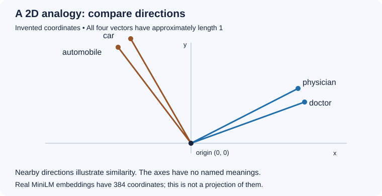

# Activity 3: Find Relevant Information with Semantic Search

**RAG Part 1 — short version**

<!-- How can a search for *"Where do helicopters land?"* find a sentence about a *"rooftop helipad"*? -->

In this activity, you will build a search system for **MediCore, a fictional hospital**. It returns stored text that may help answer a question. In Activity 4, a language model will use retrieved text to generate an answer.

By the end, you should be able to:

- Explain what an embedding represents.
- Retrieve and inspect the top matching passages.
- Explain why a close match may not contain the answer.
- Update a stored fact without training a model.

Use this version for the core lesson. [The longer version](activity3-l.md) includes the same core cells followed by additional experiments.

## Before you start

Open a new Google Colab notebook. Copy each Python block into a separate code cell and run them in order. A **CPU runtime is enough**; no GPU or API key is needed. Internet access is needed to install packages and download the model and dataset.

You only need basic Python lists, dictionaries, and loops. The first model download may take a few minutes.

| Component | Its job |
| :--- | :--- |
| MiniLM embedding model | Convert text into a list of numbers |
| Chroma vector database | Store records and search their vectors |
| Qwen language model, in Activity 4 | Generate an answer from the question and retrieved text |

There is **no answer generation or model training** in this activity.

## Step 0: Install the libraries

```python
# Cell 0 — Run before importing the libraries.
%pip install -q "opentelemetry-api>=1.39.0,<=1.42.1" "opentelemetry-sdk>=1.39.0,<=1.42.1" "chromadb>=1.0,<2" "sentence-transformers>=3,<6"
```

Chroma manages the searchable collection. Sentence Transformers loads the embedding model. The OpenTelemetry bounds retain the original lab's Colab dependency workaround; these are supporting libraries, not concepts you need to study here. Package compatibility depends on the current Colab environment, so these ranges are not a guarantee or a frozen environment.

If Colab requests a session restart after installation, restart it and continue from Cell 1. If installation reports a dependency conflict, inspect the message before continuing.

## Step 1: Understand an embedding

An **embedding** is a list of numbers produced by a trained model to represent an input. For text search, the model has learned patterns that often place related texts near one another.

Imagine representing each word with just two numbers:



**The coordinates in this picture are invented for teaching.** They are not MiniLM output. The axes have no assigned meanings such as "medical" or "mechanical."

The arrows start at the same origin. Doctor and physician point in similar directions; car and automobile form another pair. This helps us picture **cosine similarity**, which compares vector directions. Longer arrows alone would not mean greater cosine similarity.

Real MiniLM embeddings have **384 coordinates**, so we cannot draw their full geometry on a page. One coordinate does not usually have a simple label.

### Inspect real sentence embeddings

**Predict:** Which pair below should be more similar?

```python
# Cell 1 — Real embeddings.
from sentence_transformers import SentenceTransformer
import numpy as np

MODEL_NAME = "sentence-transformers/all-MiniLM-L6-v2"
embed_model = SentenceTransformer(MODEL_NAME, device="cpu")

sentences = [
    "The physician examined the patient.",
    "A doctor checked the sick individual.",
    "The sports car drove down the highway.",
]
vectors = embed_model.encode(sentences)

def cosine_similarity(a, b):
    return float(np.dot(a, b) / (np.linalg.norm(a) * np.linalg.norm(b)))

print("Array shape:", vectors.shape)
print("First five coordinates of sentence 1:", vectors[0][:5])
print("Medical pair:", round(cosine_similarity(vectors[0], vectors[1]), 3))
print("Medical/car pair:", round(cosine_similarity(vectors[0], vectors[2]), 3))
```

**Inspect:** The shape should be `(3, 384)`: three sentences, with 384 numbers each. Compare the two scores; do not look for a particular decimal value.

Cosine similarity ranges from −1 to 1. Larger values indicate more aligned vectors. It is **not a probability that two texts mean the same thing**, and zero is not proof of no semantic relationship.

**Explain:** Why can two sentences with different words have a relatively high similarity?

<details>
<summary>Discussion answer</summary>

The model learned patterns connecting related expressions during training. Similar wording is not required, although similar meaning is not guaranteed either. It can make mistakes with negation, names, numbers, or unfamiliar terms.

</details>

## Step 2: Inspect the source data

The dataset contains question-and-answer records. We will search the `completion` text and keep the original `prompt` as descriptive metadata.

```python
# Cell 2 — Download and read JSON Lines.
import json
from pathlib import Path
from urllib.request import urlretrieve

DATA_URL = (
    "https://raw.githubusercontent.com/AI-Learning-Repo/"
    "Data-Handling/refs/heads/week4/datasets/MediCore.json"
)
data_path = Path("MediCore.json")
if not data_path.exists():
    urlretrieve(DATA_URL, data_path)

with data_path.open(encoding="utf-8") as f:
    records = [json.loads(line) for line in f if line.strip()]

print("Number of records:", len(records))
print(json.dumps(records[0], indent=2, ensure_ascii=False))
```

Despite its `.json` filename, this is **JSON Lines**: each nonempty line is a separate JSON object. That is why the code reads one line at a time.

For this small dataset, each answer is treated as one **document**, or searchable passage. We do not split it further. In other datasets, a short answer such as "Yes" would need its question or heading included to make sense.

## Step 3: Build the searchable collection

A collection groups documents, their embeddings, and identifying information.

| Stored item | Purpose |
| :--- | :--- |
| Document | The text we want to retrieve |
| Embedding | Numbers used for similarity search |
| ID | A unique label used to get or update a record |
| Metadata | Extra fields, such as the original question or source |

```python
# Cell 3 — Create a fresh in-memory collection and index the records.
import hashlib
import chromadb
from chromadb.utils import embedding_functions

# A question-based ID stays the same if the dataset rows are reordered.
def record_id(question):
    return "fact_" + hashlib.sha256(question.encode("utf-8")).hexdigest()

ids = [record_id(item["prompt"]) for item in records]
if len(ids) != len(set(ids)):
    raise ValueError("Repeated questions found; inspect the dataset before indexing.")

documents = [item["completion"] for item in records]
metadatas = [
    {"source": "MediCore.json", "source_prompt": item["prompt"]}
    for item in records
]

chroma_client = chromadb.EphemeralClient()
embedding_fn = embedding_functions.SentenceTransformerEmbeddingFunction(
    model_name=MODEL_NAME,
    device="cpu",
)

# Re-running this cell resets ONLY this activity's collection.
collection_name = "activity3_medicore_cosine"
existing_names = [c.name for c in chroma_client.list_collections()]
if collection_name in existing_names:
    chroma_client.delete_collection(collection_name)

collection = chroma_client.create_collection(
    name=collection_name,
    embedding_function=embedding_fn,
    configuration={"hnsw": {"space": "cosine"}},
)
collection.add(documents=documents, metadatas=metadatas, ids=ids)
print("Indexed records:", collection.count())
```

Chroma calls MiniLM to embed the documents. Later, it uses the **same embedding model** for questions, making the vectors comparable. Metadata is stored separately; the original question is not embedded in this example.

We explicitly choose **cosine distance**:

> cosine distance = 1 − cosine similarity

A smaller distance means a closer vector match. For example, a similarity of 0.8 corresponds to a distance of 0.2. Neither number means "80% correct."

The `hnsw` setting names Chroma's search index; you do not need its internal algorithm for this lesson. An index helps search efficiently without requiring every query to compare against every stored vector.

This collection is temporary. A new Colab runtime needs to run the setup again. Re-running Cell 3 restores the records from the downloaded dataset, including undoing the later CEO edit.

## Step 4: Retrieve and read the evidence

**Top-k retrieval** requests the `k` closest matches. Here, `k=2`.

```python
# Cell 4 — A helper that prints and returns the retrieved records.
def search(query, k=2):
    results = collection.query(
        query_texts=[query],
        n_results=k,
        include=["documents", "distances", "metadatas"],
    )
    print("\nQUESTION:", query)
    for rank, (doc_id, text, distance) in enumerate(
        zip(results["ids"][0], results["documents"][0], results["distances"][0]),
        start=1,
    ):
        print(f"\nRank {rank} | cosine distance {distance:.3f}")
        print("ID:", doc_id)
        print(text)
    return results

results = search("Who leads the neurology department at MediCore Hospital?")
```

The API accepts several questions at once. We supplied a list containing one question, so `results["documents"][0]` means **the documents returned for the first question**. The first document inside that list is rank 1.

**Inspect:** Does a returned passage actually name the department leader? A description of what neurology treats is related to the topic, but may not answer who leads it.

Now change the wording and the number of results:

```python
# Cell 5 — Compare wording and k.
results = search("Who is in charge of brain and nervous system conditions?", k=2)
results = search("Where do helicopters land?", k=1)
results = search("Where do helicopters land?", k=3)
```

**Record:** For each question, write down the best supporting passage and its rank. If none answers the question, say so. Results and distances may vary with the query, data, and library versions.

**Explain:** Did increasing `k` add useful evidence, irrelevant text, or both?

## Step 5: Search for missing information

A search system can return close matches even when none contains an answer.

```python
# Cell 6 — Read the results rather than assuming they answer the question.
results = search("What is the name of MediCore Hospital's chief veterinary surgeon?")
```

**Inspect:** Do any passages explicitly name a person in that role? A passage about another surgeon is insufficient evidence.

If the retrieved passages do not contain the answer, that alone does not establish that the whole database lacks it. There are two possibilities: the fact is absent, or retrieval missed it.

Chroma returns candidate passages; it does not decide whether a question has been answered. A distance score alone does not settle that decision.

## Step 6: Change a fact without training

Suppose the fictional hospital appoints a new CEO. We can edit its stored record and create a new embedding without changing the embedding model's parameters.

```python
# Cell 7 — Locate the record by its question, then compare before and after.
ceo_question = "Who is the CEO of MediCore Hospital?"
matches = [item for item in records if item["prompt"] == ceo_question]
if len(matches) != 1:
    raise ValueError("Expected one CEO record. Inspect the dataset before updating.")

ceo_id = record_id(ceo_question)
original_text = matches[0]["completion"]

# Restore the original first, so re-running this cell repeats the experiment.
collection.update(ids=[ceo_id], documents=[original_text])
print("BEFORE UPDATE")
before = search(ceo_question, k=2)

collection.update(
    ids=[ceo_id],
    documents=["The CEO of MediCore Hospital is Milla Kallio."],
)
print("\nSTORED RECORD AFTER UPDATE")
print(collection.get(ids=[ceo_id], include=["documents"])["documents"][0])

print("\nSEARCH AFTER UPDATE")
after = search(ceo_question, k=2)
print("\nUpdated record retrieved:", ceo_id in after["ids"][0])
```

Two separate checks matter: **was the record changed, and was it retrieved?** Updating storage does not guarantee a particular rank.

Only the temporary Chroma record changed. The downloaded file and model parameters did not. In Activity 4, retrieved text will be added to a language model's prompt; it still needs to use that evidence correctly.

## Check your understanding

Before moving on, explain in your own words:

1. What does MiniLM produce, and what does Chroma return?
2. Why can a query match a passage that uses different words?
3. Does a low distance guarantee that a passage answers the question?
4. What changes when we update a document?
5. Why have we not yet built a complete RAG system?

<details>
<summary>Suggested answers</summary>

1. MiniLM produces numerical vectors. Chroma returns stored documents and associated information.
2. The model can represent related expressions with similar vector directions.
3. No. Read the passage and check whether it supports the required answer.
4. The stored text and its embedding change. The model parameters do not.
5. We have built retrieval. Activity 4 adds the retrieved evidence to a prompt and generates an answer.

</details>

## Continue

In [Activity 4](activity4.md), you will connect retrieval to generation. RAG can help produce answers supported by evidence, but both the retrieved passages and generated answer need checking.

For more retrieval practice, use [Activity 3 — longer version](activity3-l.md).

## References

- [MiniLM model card](https://huggingface.co/sentence-transformers/all-MiniLM-L6-v2): the embedding model and its input limits.
- [Chroma collection configuration](https://docs.trychroma.com/docs/collections/configure): explicit distance metrics and indexes.
- [Chroma updates](https://docs.trychroma.com/docs/collections/update-data): changing stored documents and embeddings.
