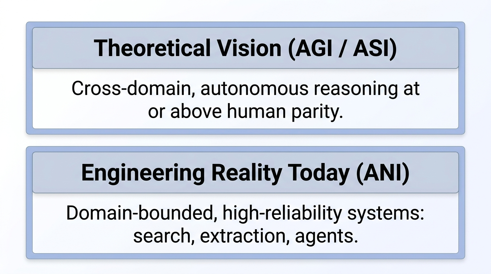
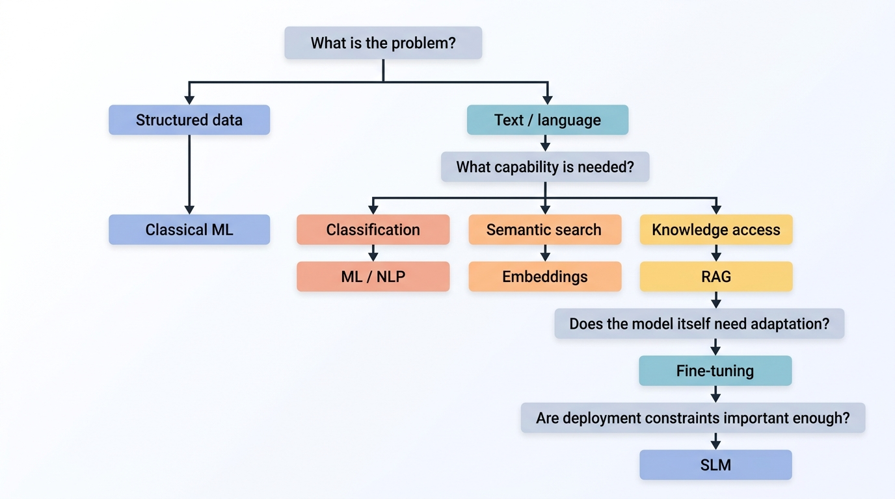
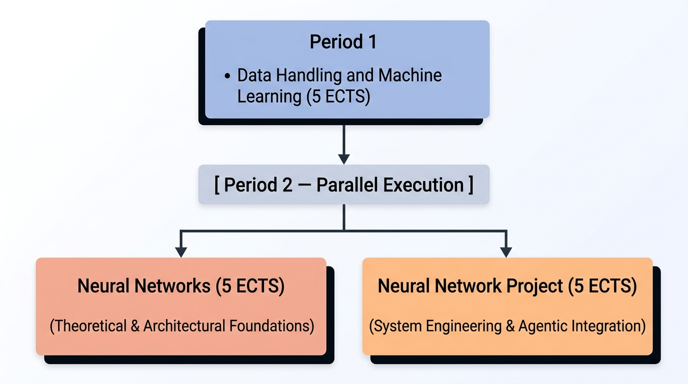
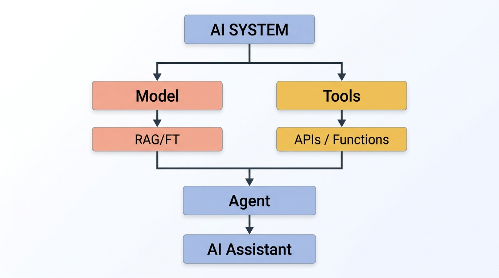
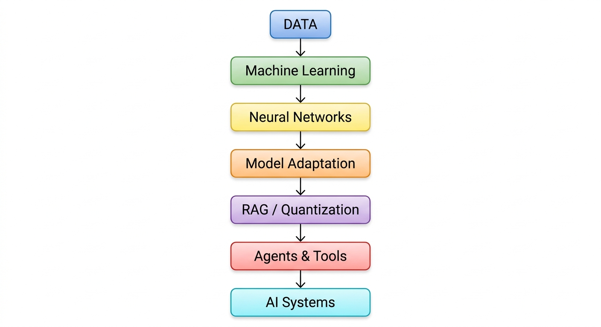

# From Data to AI Agents: Why This 3-Course Package Matters

## 1. The Reality of AI Engineering Today

Artificial General Intelligence (AGI) describes the idea of autonomous systems capable of performing a broad range of intellectual tasks at or above human capability. AGI remains an important long-term research goal, but most AI systems being developed and deployed today are much more focused.

They are examples of **Artificial Narrow Intelligence (ANI)**: systems designed to perform particular tasks within specific domains.

<!-- 
```text
┌─────────────────────────────────────────────────────────────────────────┐
│                                                                         │
│   Long-Term Vision (AGI / ASI)                                          │
│   Broad, cross-domain autonomous reasoning.                             │
│                                                                         │
├─────────────────────────────────────────────────────────────────────────┤
│                                                                         │
│   Engineering Reality Today (ANI)                                      │
│   Specialized systems for search, prediction, extraction, agents, etc. │
│                                                                         │
└─────────────────────────────────────────────────────────────────────────┘
```
-->



This distinction is important for AI engineering. Building useful AI systems today is usually not about finding the largest or most general model available. It is about selecting an approach that is **appropriate for the problem**.

A model that is excellent at general reasoning may not be the best choice for a specialized application. In practice, model selection involves several dimensions, including model scale and the degree of domain adaptation.

|                             | General-Purpose Systems | Domain-Adapted Systems         |
| --------------------------- | ----------------------- | ------------------------------ |
| **Large Scale (70B–700B+)** | Frontier Cloud Models   | Large Domain Foundation Models |
| **Compact Scale (1B–8B)**   | Compact Base Models     | **Domain-Specific SLMs**       |

The goal is therefore not simply to use the largest model available. The goal is to find the **simplest sufficient architecture** that provides the required capability while meeting practical requirements for accuracy, latency, cost, privacy, and security.

---

## 2. From Models to Real-World Engineering Constraints

Once an AI system moves from experimentation to real-world use, additional constraints become important.

### Cost and Infrastructure

Large models can provide impressive capabilities, but their computational requirements can also be substantial.

1. **Large Open-Weight Models Require Significant Resources:** Models such as GLM-5.2 744B require substantial computing resources for self-hosting, including multi-GPU systems, high memory bandwidth, and significant cooling capacity ([How to Run GLM-5.2 744B Locally](https://explore.n1n.ai/blog/run-glm-5-2-locally-open-weights-guide-2026-06-15)).

2. **Cloud API Costs Scale With Usage:** Cloud APIs are useful for prototyping and production applications, but usage-based pricing can become significant when systems involve autonomous agent loops, multi-turn conversations, or large RAG workloads:
    * [Axios: Enterprise AI Spending and ROI Analysis](https://www.axios.com/2026/05/28/ai-spending-roi-enterprise-costs)
    * [MSN: Analysis of Token Consumption Costs vs. Productivity Gains](https://www.msn.com/en-us/news/technology/enterprises-pull-back-on-ai-spending-as-token-bills-outpace-productivity-gains/ar-AA26DDZv)

3. **Smaller Models Can Offer Different Trade-Offs:** Advances in quantization, including GGUF and 4-bit AWQ, make it possible to run capable 3B–8B Small Language Models (SLMs) on relatively accessible hardware. For some applications, this can provide a useful combination of performance, predictable costs, and deployment control.

These considerations do not make local or smaller models universally better. Instead, they make **model and deployment selection an engineering decision**.

---

## 3. Control, Privacy, and Governance

Cost and performance are only part of the picture. The way an AI system is deployed can also affect privacy, governance, and control over its outputs.

### Regulatory Requirements

Regulatory frameworks such as the EU AI Act introduce requirements related to transparency, traceability, and the responsible deployment of AI systems ([European Commission Overview on AI Transparency and Safety](https://commission.europa.eu/news-and-media/news/safer-and-more-transparent-ai-2026-08-02_en)).

### Data and Privacy

In fields such as legal services, healthcare, finance, and journalism, privacy requirements, organizational policies, or regulatory obligations may limit the use of external cloud APIs for sensitive information.

Using locally hosted or privately deployed models can provide greater control over where data is processed and how it moves through an AI system.

### Watermarking and Output Control

Some AI providers are exploring statistical watermarking techniques for generated text ([Anthropic Claude Text Watermarking Architecture](https://www.anthropic.com/news/claude-text-watermark) / [Nature Analysis on LLM Watermarking](https://www.nature.com/articles/s41586-024-08025-4)).

For some users, this raises questions about how generated content is identified, attributed, and governed. Journalists, researchers, publishers, and organizations working with proprietary content may therefore have an interest in greater control over the models they use and the way those models generate outputs.

This does not mean that watermarking alone determines whether a model should be hosted locally. Rather, it is one of several factors—including privacy, cost, customization, and governance—that can influence the decision to use an independently deployed or fine-tuned model.

Together, these considerations point toward a broader requirement: **AI engineers need to understand not only how to use models, but also how models can be adapted, deployed, evaluated, and controlled.**

---

## 4. The Engineering Decision: Start With the Problem

The practical question is therefore not:

> *Which is the biggest model available?*

It is:

> **What is the simplest AI architecture that solves this particular problem?**

A typical decision process might look like this:

<!-- 
```text
                    What is the problem?
                             │
            ┌────────────────┴────────────────┐
            │                                 │
     Structured data                   Text / language
            │                                 │
     Classical ML                      What capability is needed?
                                              │
                    ┌─────────────────────────┼─────────────────────────┐
                    │                         │                         │
             Classification            Semantic search           Knowledge access
                    │                         │                         │
                ML / NLP                  Embeddings                   RAG
                                                                        │
                                                               ┌────────┴────────┐
                                                               │                 │
                                                        Need model adaptation?  No adaptation
                                                               │
                                                          Fine-tuning
                                                               │
                                                    Need local/private or
                                                    resource-efficient deployment?
                                                               │
                                                              SLM
``` -->



This framework also highlights an important point: **RAG, fine-tuning, and model size are separate engineering decisions**.

A system may use RAG without fine-tuning. A model may be fine-tuned without RAG. A large model may be deployed with retrieval, while a smaller model may be sufficient for another application.

The appropriate combination depends on the problem and its requirements.

---

# 5. From Engineering Decisions to the 3-Course Curriculum

This decision-making process explains why AI engineering requires several layers of knowledge.

It is not enough to know how to write prompts or call an API. Building and evaluating AI systems requires an understanding of:

**data → models → systems**

The **15 ECTS course package** follows this progression across two periods.

<!-- 
```text
[ Period 1 ]
Course 1: Data Handling and Machine Learning (5 ECTS)
                     │
                     ▼
[ Period 2 — Parallel Execution ]
┌────────────────────┴────────────────────┐
▼                                         ▼
Course 2: Neural Networks (5 ECTS)        Course 3: Neural Network Project (5 ECTS)
(Understanding Models)                    (Building AI Systems)
``` 
-->



---

## Period 1: Data Foundations

### Course 1: Data Handling and Machine Learning — 5 ECTS

**Focus:** Data engineering, data cleaning, feature transformation, baseline machine-learning models, and validation.

**Why it matters:** AI systems depend on the quality of the data they use. Strong data pipelines provide the foundation for training, evaluation, retrieval, and later model adaptation.

The course establishes the first layer of AI engineering: **working reliably with data**.

---

## Period 2: Understanding and Building Neural Systems

The second period develops two complementary skills in parallel: understanding how neural networks work and applying that knowledge to complete AI systems.

### Course 2: Neural Networks — 5 ECTS

**Focus:** Deep learning concepts including loss functions and optimization, backpropagation, attention mechanisms, and Transformer architectures.

**Why it matters:** Understanding the mechanisms behind neural networks makes it easier to reason about model behavior, optimization, evaluation, and failure modes rather than treating models entirely as black boxes.

This course provides the second layer: **understanding the models themselves**.

---

### Course 3: Neural Network Project — 5 ECTS

**Focus:** Building practical AI systems using techniques such as parameter-efficient fine-tuning (LoRA/QLoRA), RAG pipelines, model quantization (GGUF/AWQ), and tool integration.

**Why it matters:** A useful AI assistant is more than a neural network. It is a system that combines models with data, retrieval, memory, evaluation, and external tools.
<!-- 
```text
                     AI SYSTEM
                         │
                ┌────────┴────────┐
                │                 │
              Model             Tools
                │                 │
            RAG / FT       APIs / Functions
                │                 │
                └────────┬────────┘
                         │
                       Agent
                         │
                    AI Assistant
``` 
-->



This course provides the third layer: **turning models into complete AI systems**.

---

# 6. The Overall Learning Path

The three courses follow a progression from foundations to implementation:
<!-- 
```text
       DATA
         │
         ▼
   Machine Learning
         │
         ▼
  Neural Networks
         │
         ▼
   Model Adaptation
         │
         ▼
 RAG / Quantization
         │
         ▼
  Agents & Tools
         │
         ▼
    AI Systems
``` 
-->



By the end of the package, students have moved through three connected levels:

| Level          | Course                           | Core Question                                 |
| -------------- | -------------------------------- | --------------------------------------------- |
| **1. Data**    | Data Handling & Machine Learning | How do we prepare and learn from data?        |
| **2. Models**  | Neural Networks                  | How do modern neural models work?             |
| **3. Systems** | Neural Network Project           | How do we turn models into useful AI systems? |

This progression reflects the way AI engineering problems are approached in practice.

The objective is not to teach one particular model, framework, or deployment strategy. It is to provide the knowledge needed to **evaluate different approaches and make informed engineering decisions** as the technology continues to change.

In that sense, the curriculum moves from **working with data**, to **understanding models**, to **building systems**.


---

### Additional References

For a formal conceptual breakdown of these definitions, see 
  - the [NeuralBuddies Analysis on ANI, AGI, and ASI](https://www.neuralbuddies.com/p/ai-agi-asi-whats-the-difference) or 
  - the [Deep Learning and Neural Systems Repository](https://github.com/jeffheaton/app_deep_learning/blob/main/t81_558_class_01_2_ai_neural.ipynb).

