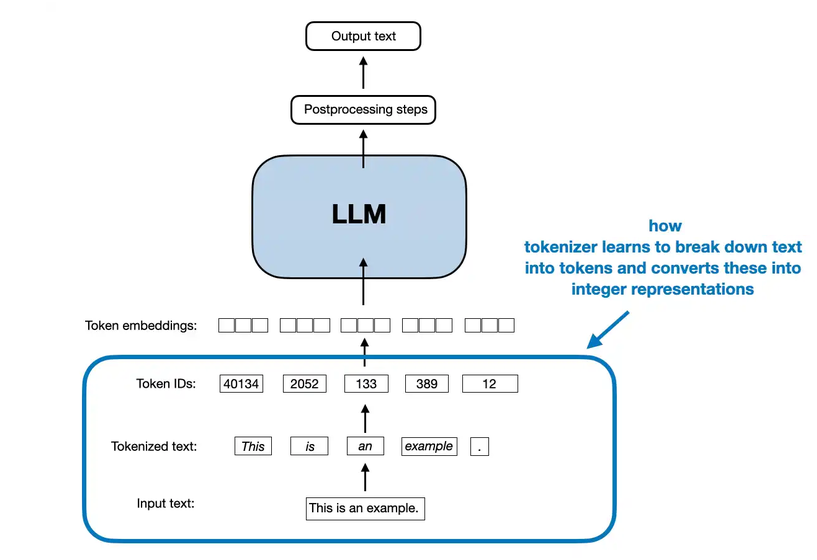

# Tokenisation and Byte Pair Encoding (BPE)

<a href="https://sebastianraschka.com/blog/2025/bpe-from-scratch.html" ></a>

## 1. From text to tokens

Language models do not process text directly. They process sequences of numbers.

For example, consider the text:

```text
lower
```

One simple way to represent it is to split it into individual characters:

```text
l  o  w  e  r
```

We could then assign each character an integer ID:

```text
l → 0
o → 1
w → 2
e → 3
r → 4
```

The word `lower` would therefore become:

```text
[0, 1, 2, 3, 4]
```

This is already a form of tokenisation.

However, representing every character separately can produce very long sequences. A tokenizer can instead learn frequently occurring groups of characters and represent them as single tokens.

This is where **Byte Pair Encoding (BPE)** becomes useful.

---

## 2. A small example

To make the idea easy to see, we will use a very small training corpus:

```text
low
lower
lowest
low
lower
```

We start by treating every character as a separate token.

```text
l o w
l o w e r
l o w e s t
l o w
l o w e r
```

The basic idea of BPE is simple:

> **Repeatedly find a frequent pair of neighboring tokens and merge them into a new token.**

We can implement the first part in Python.

```python
from collections import Counter

text = """
low
lower
lowest
low
lower
"""

tokens = list(text.replace("\n", ""))

pairs = Counter(zip(tokens, tokens[1:]))

print(pairs.most_common(5))
```

Here's the result:

```text
[(('l', 'o'), 5), (('o', 'w'), 5), (('w', 'e'), 3), (('w', 'l'), 2), (('e', 'r'), 2)]
```

There are several frequent pairs. We can choose the most frequent one.

For this example:

```text
l + o → lo
```

<details>
<summary>About the Code</summary>

This Python code calculates the frequency of adjacent character pairs (bigrams) in a given text. This specific operation—finding the most common pair of characters—is the foundational first step of the **Byte Pair Encoding (BPE)** algorithm.

* **`text.replace("\n", "")`**: This removes all the invisible newline characters, mashing all the words into one continuous string: `"lowlowerlowestlowlower"`.
* **`list(...)`**: This takes that continuous string and splits it into a list of individual characters. 
* **State of `tokens`:** 
  `['l', 'o', 'w', 'l', 'o', 'w', 'e', 'r', 'l', 'o', 'w', 'e', 's', 't', 'l', 'o', 'w', 'l', 'o', 'w', 'e', 'r']`

**Creating Adjacent Pairs (Bigrams)**

```python
zip(tokens, tokens[1:])
```
This is a classic Python trick to create overlapping pairs from a list.
* `tokens` is the full list starting at index 0.
* `tokens[1:]` is a copy of the list shifted by one position (starting at index 1).
* `zip()` pairs them up side-by-side.

It essentially does this:
```text
List 1:  ['l', 'o', 'w', 'l', 'o', 'w', ...]
List 2:  ['o', 'w', 'l', 'o', 'w', 'e', ...]
Zipped:  [('l', 'o'), ('o', 'w'), ('w', 'l'), ('l', 'o'), ('o', 'w'), ('w', 'e'), ...]
```
*(Notice how it creates cross-word pairs like `('w', 'l')` because the newline characters were removed and the words were mashed together).*

**Counting the Pairs**

```python
from collections import Counter
...
pairs = Counter(...)
```
`Counter` takes the zipped list of pairs and tallies them up into a frequency dictionary. It counts how many times every specific tuple appears.

**Getting the Top Results**

```python
print(pairs.most_common(5))
```
The `.most_common(5)` method sorts the dictionary by frequency and returns the top 5 results as a list of tuples (where each tuple contains the character pair and its count).

**What is the Output?**
```python
[(('l', 'o'), 5), (('o', 'w'), 5), (('w', 'e'), 3), (('w', 'l'), 2), (('e', 'r'), 2)]
```

**Note on BPE accuracy:** 

In a real LLM tokenizer, words are usually separated by a space or a pre-tokenization boundary before this step. Because this specific code removed the `\n` without replacing it with spaces, it accidentally creates merged pairs across word boundaries (like the `('w', 'l')` which bridges the end of "lo**w**" and the beginning of "**l**ower"). Modern tokenizers use Regex to prevent these cross-word merges.

</details>

---

## 3. The first merge

We replace every occurrence of `l o` with the new token `lo`.

Before:

```text
l o w
l o w e r
l o w e s t
l o w
l o w e r
```

After:

```text
lo w
lo w e r
lo w e s t
lo w
lo w e r
```

We can perform this replacement in Python:

```python
def merge_pair(tokens, pair, new_token):
    result = []
    i = 0

    while i < len(tokens):
        if i < len(tokens) - 1 and (tokens[i], tokens[i + 1]) == pair:
            result.append(new_token)
            i += 2
        else:
            result.append(tokens[i])
            i += 1

    return result


tokens = list("lowlowerlowestlowlower")

tokens = merge_pair(tokens, ("l", "o"), "lo")

print(tokens)
```

The result begins:

```text
['lo', 'w', 'lo', 'w', 'e', 'r', ...]
```

We have learned a new token:

```text
lo
```

---

## 4. The next merge

We now look for frequent pairs again.

The pair:

```text
lo + w
```

occurs five times.

So we merge it:

```text
lo + w → low
```

The text now looks like:

```text
low
low e r
low e s t
low
low e r
```

We have discovered another useful token:

```text
low
```

The process can continue:

```text
low + e → lowe
```

and then:

```text
lowe + r → lower
```

The important point is not the particular vocabulary we obtain. The important point is the process:

```text
characters
    ↓
frequent pair
    ↓
merge
    ↓
frequent pair
    ↓
merge
    ↓
larger tokens
```

BPE therefore allows a tokenizer to represent common pieces of text with fewer tokens.

---

## 5. From tokens to token IDs

The model does not receive the strings `"low"` or `"lower"` directly.

Each token is assigned an integer ID.

For example, we might have:

```text
Token       ID
-----       --
l            0
o            1
w            2
e            3
r            4
s            5
t            6
lo           7
low          8
lower        9
```

Now:

```text
lower
```

can be represented as:

```text
[9]
```

while:

```text
lowest
```

could be represented as:

```text
[8, 3, 5, 6]
```

The exact IDs are arbitrary. What matters is that the tokenizer maintains a mapping between tokens and integers.

In Python:

```python
vocab = {
    "l": 0,
    "o": 1,
    "w": 2,
    "e": 3,
    "r": 4,
    "s": 5,
    "t": 6,
    "lo": 7,
    "low": 8,
    "lower": 9,
}

print(vocab["lower"])
```

Output:

```text
9
```

---

# 6. Encoding: text → token IDs

We can now describe the forward process.

Suppose we have learned the following merges:

```text
l + o → lo
lo + w → low
low + e → lowe
lowe + r → lower
```

When we encounter:

```text
lower
```

we start with individual characters:

```text
l o w e r
```

Then apply the learned merges:

```text
l o w e r
↓
lo w e r
↓
low e r
↓
lowe r
↓
lower
```

Finally, the token is converted into its ID:

```text
lower → 9
```

So the complete encoding process is:

```text
"lower"
   ↓
characters
   ↓
BPE merges
   ↓
["lower"]
   ↓
[9]
```

---

# 7. Decoding: token IDs → text

The process also works in reverse.

Suppose the tokenizer gives the model:

```text
[9]
```

The tokenizer looks up ID `9`:

```text
9 → "lower"
```

and reconstructs the original text.

More generally:

```text
token IDs
   ↓
tokens
   ↓
characters / bytes
   ↓
original text
```

For example:

```text
[8, 3, 5, 6]
```

might first become:

```text
["low", "e", "s", "t"]
```

and then:

```text
["low", "e", "s", "t"]
          ↓
       "lowest"
```

A simple Python vocabulary can perform the reverse lookup:

```python
vocab = {
    "l": 0,
    "o": 1,
    "w": 2,
    "e": 3,
    "r": 4,
    "s": 5,
    "t": 6,
    "lo": 7,
    "low": 8,
    "lower": 9,
}

inverse_vocab = {id_: token for token, id_ in vocab.items()}

ids = [8, 3, 5, 6]

tokens = [inverse_vocab[i] for i in ids]

print(tokens)
```

Output:

```text
['low', 'e', 's', 't']
```

We can then concatenate them:

```python
text = "".join(tokens)

print(text)
```

Output:

```text
lowest
```

Thus:

```text
TEXT → TOKENS → TOKEN IDs
               ↓
            MODEL
               ↓
TEXT ← TOKENS ← TOKEN IDs
```

The tokenizer therefore provides a reversible representation of the text.

---

# 8. Training a BPE tokenizer vs. using it

There are two different processes that are useful to distinguish.

### Training the tokenizer

During tokenizer training, we examine a training corpus and learn useful merges.

For example:

```text
l + o → lo
lo + w → low
low + e → lowe
lowe + r → lower
```

These merge rules become part of the tokenizer.

### Encoding new text

Once the tokenizer has been trained, we do not learn new merges every time.

For new text:

```text
lower
```

we simply apply the existing rules:

```text
l o w e r
↓
lo w e r
↓
low e r
↓
lowe r
↓
lower
↓
token ID
```

So:

> **Training learns the vocabulary and merge rules. Encoding applies those learned rules.**

---

# 9. Why use subword tokens?

Character-level tokenisation has a useful property: it can represent essentially any text.

But it can create long sequences.

Consider:

```text
internationalization
```

Character-level tokenisation might produce:

```text
i n t e r n a t i o n a l i z a t i o n
```

A subword tokenizer can learn recurring pieces such as:

```text
inter
nation
al
ization
```

The exact tokens depend on the tokenizer and its training data, but the general idea is that common pieces can be represented by single tokens.

This gives a useful compromise:

* **Character tokens**: small vocabulary, but long sequences
* **Whole-word tokens**: shorter sequences, but a very large vocabulary and difficulty with unknown words
* **Subword tokens**: a compromise between the two

BPE is one way to construct such a subword vocabulary.

---

# 10. Why is it called "Byte Pair Encoding"?

Our simple example started with characters:

```text
l o w e r
```

The name **Byte Pair Encoding** comes from the fact that practical BPE tokenizers often begin with bytes rather than Unicode characters.

A byte contains 8 bits, so there are:

```text
2⁸ = 256
```

possible byte values.

A byte-level tokenizer can therefore begin with a basic vocabulary of 256 byte values and then learn larger tokens by merging frequently occurring pairs.

Conceptually, however, the important part is unchanged:

```text
initial units
     ↓
find frequent adjacent pair
     ↓
merge the pair
     ↓
repeat
```

For a first implementation, using characters instead of bytes makes the algorithm easier to understand. Once the merging process is clear, the byte-level implementation can be introduced as the practical extension.

---

# 11. A small complete BPE example

We can now summarize the process with a slightly different example:

```text
the cat in the hat
```

Suppose we start with individual characters.

The pair:

```text
t + h
```

appears twice.

We therefore create a new token:

```text
256 → "th"
```

and replace both occurrences:

```text
<256>e cat in <256>e hat
```

Now:

```text
<256> + e
```

also occurs twice.

We create another token:

```text
257 → "<256>e"
```

giving:

```text
<257> cat in <257> hat
```

The next frequent pair can be:

```text
<257> + " "
```

which gives:

```text
258 → "<257> "
```

and the text becomes:

```text
<258>cat in <258>hat
```

The tokenizer has therefore learned increasingly large pieces:

```text
th
 ↓
the
 ↓
the␠
```

where the space is also part of the learned representation.

This illustrates the same basic process as our simpler `low / lower / lowest` example, but with spaces and token IDs included.

---

# 12. Decoding the BPE example

The reverse process is particularly important.

We ended with:

```text
<258>cat in <258>hat
```

The tokenizer knows:

```text
258 → <257>␠
257 → <256>e
256 → th
```

So decoding reverses the merges:

```text
<258>cat in <258>hat
        ↓
<257> cat in <257> hat
        ↓
<256>e cat in <256>e hat
        ↓
the cat in the hat
```

This demonstrates an important property of BPE:

> The merge operations used to create tokens can be reversed to reconstruct the original text.

---

# 13. The complete picture

A tokenizer can therefore be viewed as a two-way transformation:

```text
                 ENCODING
                    ↓
TEXT ─────────→ TOKENS ─────────→ TOKEN IDs
                                     │
                                     │
                                   LLM
                                     │
                                     ↓
TEXT ←───────── TOKENS ←──────── TOKEN IDs
                 ↑
                 │
                 DECODING
```

For BPE, the central operation is:

```text
frequent pair
      ↓
    merge
      ↓
 new token
```

Repeated many times, this creates a vocabulary containing individual characters/bytes as well as larger and frequently occurring pieces of text.

---

# 14. Relation to real LLM tokenizers

The example above is deliberately simplified.

Modern LLM tokenizers include additional details such as:

* byte-level representations
* handling of Unicode text
* whitespace conventions
* special tokens
* predefined vocabularies
* ordered BPE merge rules

For example, GPT-style tokenizers use a much larger vocabulary than our small example.

The underlying BPE idea, however, remains straightforward:

1. Start from small units such as bytes.
2. Find frequent adjacent pairs.
3. Merge them.
4. Record the merge.
5. Repeat until the desired vocabulary size is reached.
6. Apply the learned merges when encoding new text.

---

# 15. A useful Python experiment

Once the basic idea is understood, it is useful to inspect a real tokenizer.

For example, OpenAI's `tiktoken` library provides access to GPT-style tokenizers.

```python
import tiktoken

tokenizer = tiktoken.get_encoding("gpt2")

text = "This is some text"

ids = tokenizer.encode(text)

print(ids)
```

- Demo: 
  - https://tiktokenizer.vercel.app/?model=gpt2
  - https://platform.openai.com/tokenizer

The resulting IDs represent the text using the GPT-2 tokenizer.

We can then decode them:

```python
decoded = tokenizer.decode(ids)

print(decoded)
```

The result is:

```text
This is some text
```

This gives us the complete practical cycle:

```text
"This is some text"
        ↓
   tokenizer.encode()
        ↓
[1212, 318, 617, 2420]
        ↓
   tokenizer.decode()
        ↓
"This is some text"
```

The exact token IDs and token boundaries depend on the tokenizer being used.

---

# 16. Summary

Tokenisation converts text into a representation that a language model can process.

BPE provides a way to build a useful vocabulary by repeatedly merging frequent adjacent pairs.

The core idea can be reduced to:

```text
text
 ↓
small units
 ↓
find frequent pair
 ↓
merge
 ↓
repeat
 ↓
tokens
 ↓
token IDs
```

And the reverse process is:

```text
token IDs
 ↓
tokens
 ↓
reverse the merges
 ↓
small units
 ↓
text
```

The important distinction is:

> **BPE training learns the vocabulary and merge rules. Tokenisation applies those learned rules to new text.**

The character-level example used in this demonstration is intentionally simplified. Practical LLM tokenizers commonly use bytes as their starting units, but the fundamental merging mechanism is the same.

### References

* **[Sebastian Raschka: Implementing BPE From Scratch](https://sebastianraschka.com/blog/2025/bpe-from-scratch.html)**
   *A step-by-step guide detailing a pure-Python `BPETokenizerSimple` class, including the underlying merge rankings and training routines.*
* **[LLMs from Scratch - Chapter 2 Notebook (rasbt)](https://github.com/rasbt/LLMs-from-scratch/blob/main/ch02/01_main-chapter-code/ch02.ipynb)**
   *An educational resource demonstrating the exact connection points between tokenization algorithms, embedding layers, and model input.*
* **[nanochat Repository (karpathy)](https://github.com/karpathy/nanochat)**
   *A minimal implementation demonstrating how modern Rust-backed tokenizers are trained (`scripts/tok_train.py`) and integrated into a chat pipeline (`nanochat/tokenizer.py`).*

